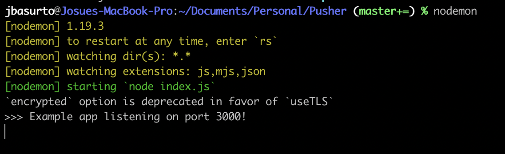

# Pusher simple example

This is a Pusher simple example used to explain how it works.

## More info @

* [Pusher](https://pusher.com) ⚡️
* [Dev Documentation](https://pusher.com/docs/channels) 👍
* [Pricing](https://pusher.com/channels/pricing) (Theres a free plan!) 💰

## Start developing

    git clone <this_repo_url>
    npm install
    nodemon

## Run it

Run 

    nodemon

Open your browser at:

    http://localhost:3000

Send a message

Will send a request to an api like this

    curl POST -d "message=<yourmessage>" http://locahost:3000/message